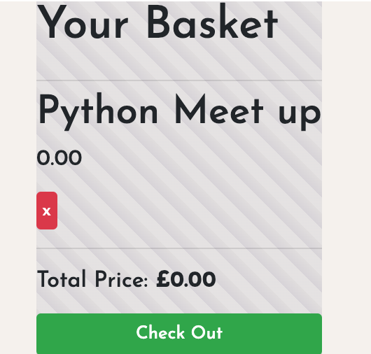

# Eventr

This project was developed as part of General Assembly's Software Engineering Immersive. This project is a full stack web application that was completed in a group of 3 over 8 days.

Please be aware there may be a delay in the initial loading of the website, this is because Heroku puts the dyno running our application to sleep when there is no traffic. 

## Brief

Eventr is an event website, for people to share and find talks that they are interested in. Once an audience member has bought a ticket, they can then start voting in polls and using the comments sections enabling audience participation before the event has event started.

## Technologies Used

* Python
* Django
* PostgreSQL
* React.js Hooks
* JavaScript(ES6) / HTML5
* SCSS
* Yarn package manager
* Axios
* Json Web Tokens
* Git
* GitHub
* Heroku

## Process

* We initially planned to make a polling app, but wanted to add more layers of complexity to the project and have more practise using SQL relationships. Adding the events meant there was more both on the back end in terms of models and relationships as well as more features and designs to work on the front end.

* Our inspiration for the design of the site was Eventbrite, we liked that there was a lot of white space and the search page has the filters running down the side. We didn't use a framework for the design, instead we worked on our own SCSS file to create the website.

* Our project started by creating the backend models and mapping out the relationships between them. It was important in the organisation of our project to take the time to plan in advance, though the polls model did change part-way through the project in order to better track the results.

* I was in a group with the same people as my previous project Roadtrippers, as such we used the same way to assign tasks - we all took ownership of the parts of the project we were most interested in as well as made sure to divide up the general parts of the project e.g. making the React components for each page.

* I worked on the back end, making the models, routes and relationships and testing them using Insomnia. On the front end I worked on implementing the polls and comments features that would be on the events page as well as the functionality for the baskets and created the individual ticket page.

##### Examples

An intial sketch of our models and relationships we used during the planning stage:

Home page showing our use of white space and textures for styling:

Our search page was inspired by Eventbrite's side panels showing different search options:

The event page showing the polls and the comments for ticker holders:

A basket model is attached to every user, this saves the users tickets ready for checkout:

Once the user checks out, they can access their tickets for the events. The tickets come with a working QR code:

## Key Learnings

My biggest take away from Eventr is that having a group working seperately each owning our individual features can lead to knowledge silos. 

We took this approach to completing the project as we did not have much time before the project was due in order to complete our MVP and additional features. This did create some issues as we could not help each other with challenges that we experienced during this project, and when features overlapped it was difficult to explain how things worked to each other. On my part this came about because I was so focused on getting the project ready for the due date, but next time I work on a group project I will definitely take a more cooperative and learning-focused approach. This would include more pair-coding and putting heads together to look at complex issues that arise during development so everyone shares the knowledge.

## Challenges and Wins

The technologies (Python and React.js Hooks) we used on this project were new to us and it was difficult using them to implement what we wanted. While it was good learning experience, it did feel frustrating at the time as it was a challenge trying to translate what we were working on in our heads into functioning code.

A big win for me was that the website has lots of small details that turns it from a project to something that feels more real. It is really interesting to see how even just small features like the animation on the polls, default images for users and events, QR Code on the tickets all add up to create a better user experience on the site.

## Future Improvements

* Due to time constraints I had to abandon the votes model, which was a shame as the original intention for this was to provide a breakdown of the data behind who was participating in the polls e.g. displaying user information such as gender and ethnicity. It would be great to implement this at a later date.

* Once the votes model is implemented, I would then use it to find out which users had already voted in the polls. Right now, we are using local storage to track this. This was put in place to demonstrate what we were hoping to achieve, but it is not ideal as the information is deleted on logout. It would be great to replace this with a more long-term solution using the votes model.

## Deployment

This project was deployed using Heroku:
https://eventr-polls.herokuapp.com/
